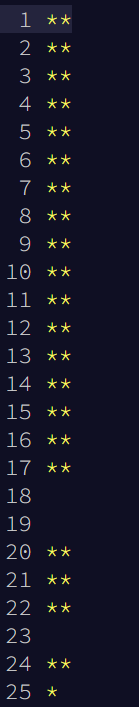

# Advent of Rust

My solutions to [advent of code 2021](https://adventofcode.com/2021)
(Will be posted after the event ends)

#### How to run 
`cargo run -- <day> <part> [-e]`  
Example:  
`cargo run -- 1 1 ` to run  day 1 part 1  
`cargo run -- 1 1 -e` to run the example for day 1 part 1  
`cargo test` to run tests

**Disclaimer**
- This is my first time doing AoC.
- I didn't compete (timezone).
- I did it to practice Rust.
- I also want to implement some algorithms from scratch, take time to think solutions by myself instead of googleing everything.
- Also, I don't want to use only 1 paradigm (like using structures for everything, use only functional programming, try to OOP everything), but rather combine them along the way.
- And lastly, I am not a competitive programmer.

